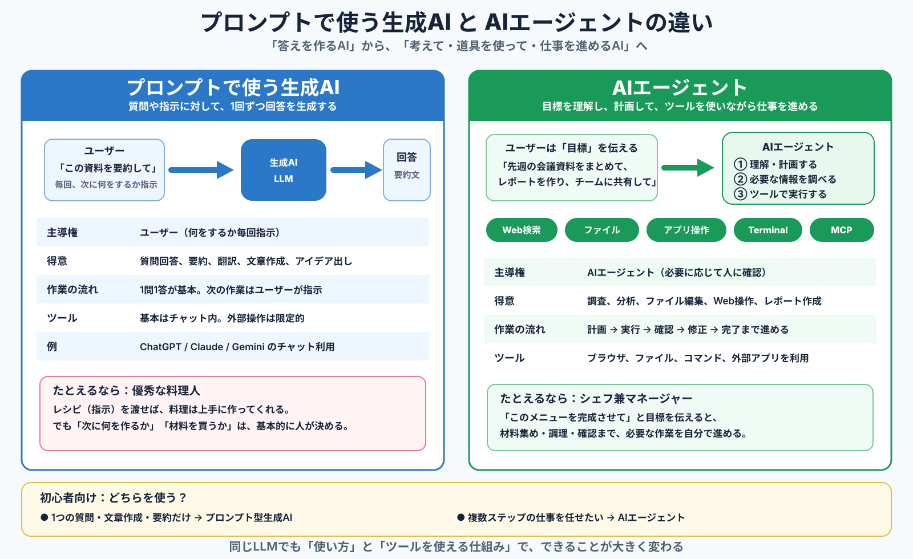

# GH200 Local LLM + Cline Desktop Remote SSH Memo

> Updated: 2026-10-01


## Visual guides

### Generative AI vs AI Agent — beginner overview

従来のプロンプト型生成AIとAIエージェントの違いを、初心者向けに1枚で整理した図です。



### Desktop AI Agent comparison — 2026-10

Codex Desktop / Cline Desktop / Claude Cowork を、Windows、Local LLM、音声入力、自動化、ブラウザ操作、拡張性、OSS / ユーザーによる不具合修正可能性の観点で比較しています。


---

## Goal

Run a local LLM on an NVIDIA GH200 Linux server and expose it as an OpenAI-compatible API with vLLM.

Use **Cline Desktop on Windows** as the agent UI. The LLM server and the server operated by the coding agent are **separate machines**.

- **LLM inference server:** GH200 + vLLM + Qwen3.8-27B-FP8
- **Agent target server:** a separate Linux development server
- **Agent workspace:** filesystem on the remote development server
- **Agent access:** Cline Desktop Remote SSH to the development server
- **LLM API access:** SSH port forwarding from Windows to the GH200 LLM server
- **Source code:** stays on the remote development server; Cline sends only the required context to the local LLM API

---

## Recommended architecture

```text
                         Windows PC
                  ┌──────────────────────┐
                  │ Cline Desktop        │
                  │                      │
                  │ Agent UI/controller  │
                  └───────┬───────┬──────┘
                          │       │
             LLM API      │       │ Remote SSH
       localhost:18000    │       │
                          │       │
                 SSH tunnel       │
                          │       │
                          ▼       ▼
             GH200 LLM Server     Remote Development Server
          ┌───────────────────┐   ┌────────────────────────┐
          │ vLLM :8000        │   │ source code / repo     │
          │      ↓            │   │ git / build / test     │
          │ Qwen3.8-27B-FP8   │   │ tools / runtime        │
          │      ↓            │   │                        │
          │ GH200             │   │ Cline Remote SSH target│
          └───────────────────┘   └────────────────────────┘
```

The key point is that there are **two independent connections** from Windows:

1. **Windows → GH200 LLM server** for inference
2. **Windows → remote development server** for file/terminal/git/build operations

The GH200 server does not need to contain the source-code workspace.

---

## Initial settings

| Item | Setting |
|---|---|
| Model | `Qwen/Qwen3.8-27B-FP8` |
| Inference server | vLLM |
| GPU | GH200 x1 |
| Tensor Parallel | TP=1 |
| Context length | Start with 32K |
| vLLM listen address | `127.0.0.1:8000` |
| Windows endpoint | `127.0.0.1:18000` |
| Agent UI | Cline Desktop |
| Workspace | Separate remote development server |
| Authentication | SSH key(s) + vLLM API key |

---

# 1. Check the GH200 environment

SSH into the server and check:

```bash
uname -m
nvidia-smi
python3 --version
free -h
df -h
```

A Grace CPU environment will normally report:

```text
aarch64
```

---

# 2. Create a Python environment for vLLM

```bash
mkdir -p ~/llm
cd ~/llm

python3 -m venv venv
source venv/bin/activate

python -m pip install -U pip uv
uv pip install vllm --torch-backend=auto
```

Check CUDA / PyTorch:

```bash
python -c "import torch; print(torch.cuda.is_available()); print(torch.cuda.get_device_name(0))"
```

Expected output is similar to:

```text
True
NVIDIA GH200 ...
```

If the AArch64 / CUDA / PyTorch combination causes wheel or dependency issues, use an official vLLM container or an ARM64/GH200-compatible build instead of manually forcing incompatible packages.

---

# 3. Generate a vLLM API key

Generate a random secret:

```bash
openssl rand -hex 32
```

Set it in the shell:

```bash
export VLLM_API_KEY='<generated-secret>'
```

Do **not** commit the real API key to GitHub.

For permanent operation, store secrets outside the repository, for example in a protected systemd EnvironmentFile.

---

# 4. Start Qwen3.8-27B-FP8 with vLLM

Start conservatively with a 32K context window and 85% GPU-memory utilization:

```bash
source ~/llm/venv/bin/activate

vllm serve Qwen/Qwen3.8-27B-FP8 \
    --host 127.0.0.1 \
    --port 8000 \
    --served-model-name qwen3.8-27b \
    --api-key "$VLLM_API_KEY" \
    --max-model-len 32768 \
    --gpu-memory-utilization 0.85
```

Notes:

- GH200 x1 means `TP=1`.
- `--tensor-parallel-size` is therefore not required initially.
- Binding to `127.0.0.1` avoids exposing the raw vLLM port to the LAN.
- Increase context length to 64K / 128K only after confirming memory usage and stability.

---

# 5. Test the API on the GH200 host

List models:

```bash
curl http://127.0.0.1:8000/v1/models \
  -H "Authorization: Bearer $VLLM_API_KEY"
```

Test Chat Completions:

```bash
curl http://127.0.0.1:8000/v1/chat/completions \
  -H "Authorization: Bearer $VLLM_API_KEY" \
  -H "Content-Type: application/json" \
  -d '{
    "model": "qwen3.8-27b",
    "messages": [
      {
        "role": "user",
        "content": "Write a hello world program in Python."
      }
    ],
    "max_tokens": 256
  }'
```

If this works, the basic LLM server is ready.

---

# 6. Create an SSH tunnel from Windows to the GH200 LLM server

From PowerShell:

```powershell
ssh -N -L 18000:127.0.0.1:8000 <user>@<gh200-host>
```

Connection path:

```text
Windows
127.0.0.1:18000
      │
      │ SSH tunnel
      ▼
GH200
127.0.0.1:8000
```

The OpenAI-compatible API is then reachable from Windows at:

```text
http://127.0.0.1:18000/v1
```

---

# 7. Configure SSH access for both servers

There are two SSH destinations:

- **GH200 LLM server**: used for the API tunnel and LLM administration
- **Remote development server**: used by Cline Remote SSH for source-code work

Create a key on Windows if needed:

```powershell
ssh-keygen -t ed25519
```

Register the public key on both servers as appropriate.

A convenient Windows SSH config is:

```sshconfig
Host gh200-llm
    HostName <gh200-host>
    User <gh200-user>
    IdentityFile C:\Users\<user>\.ssh\id_ed25519

Host cline-dev
    HostName <development-server-host>
    User <development-user>
    IdentityFile C:\Users\<user>\.ssh\id_ed25519
```

Verify both connections before using Cline:

```powershell
ssh gh200-llm
ssh cline-dev
```

Then the API tunnel can be created with:

```powershell
ssh -N -L 18000:127.0.0.1:8000 gh200-llm
```

Check that:

- key-based login works for both servers,
- both host keys are registered in Windows `known_hosts`,
- the GH200 server can run and expose vLLM locally,
- the remote development server contains the intended workspace and build environment.

---

# 8. Configure Cline Desktop Remote SSH

Add the **separate remote development server** as the Remote Environment in Cline Desktop. Do not point Cline Remote SSH at the GH200 server unless that machine is also intentionally being used as a development host.

Example:

```text
Host:
<development-server-host>

User:
<development-user>

Identity:
C:\Users\<user>\.ssh\id_ed25519
```

Workspace example:

```text
/home/<development-user>/workspace
```

Use a Cline Desktop version that includes the Remote SSH fixes introduced in 0.0.35 or later. Prefer the latest stable release available in the environment.

---

# 9. Configure the local LLM in Cline

Provider:

```text
OpenAI Compatible
```

Base URL:

```text
http://127.0.0.1:18000/v1
```

API Key:

```text
<VLLM_API_KEY>
```

Model:

```text
qwen3.8-27b
```

Context window:

```text
32768
```

---

# 10. How the agent works

```text
                         Windows
                     Cline Desktop
                          │
               ┌──────────┴──────────┐
               │                     │
          LLM request            Agent tools
               │                     │
               ▼                     ▼
          SSH tunnel            Remote SSH
               │                     │
               ▼                     ▼
        GH200 LLM Server      Development Server
             vLLM             workspace / git /
               │              build / test / runtime
               ▼
      Qwen3.8-27B-FP8
```

The two paths are intentionally separate.

### Reasoning path

```text
Cline on Windows
  ↓
SSH tunnel
  ↓
vLLM on GH200
  ↓
Qwen3.8
  ↓
Decide the next tool / command
```

### Execution path

```text
Cline on Windows
  ↓
Remote SSH
  ↓
Separate development server
  ↓
read / edit / git / build / test
```

The source code and build environment remain on the development server. The model runs on the GH200 server and receives the context that Cline sends through the OpenAI-compatible API.

---

# 11. Recommended validation sequence

## Step 1: Verify both SSH paths

For the GH200 LLM server:

```bash
uname -m
nvidia-smi
curl http://127.0.0.1:8000/v1/models \
  -H "Authorization: Bearer $VLLM_API_KEY"
```

For the remote development server:

```bash
pwd
uname -a
git --version
```

## Step 2: Read-only agent task

Example Cline prompt:

```text
Analyze this repository and explain its structure.
Do not modify any files yet.
```

## Step 3: Small file modification

```text
Create test.txt and write "Hello" into it.
```

## Step 4: Git inspection

```text
Run git diff and explain the changes.
```

## Step 5: Build and test

```text
Build this project and run its tests.
```

## Step 6: Autonomous debugging task

```text
Investigate this build error and make the necessary fix.
After the fix, run the tests again.
```

This sequence isolates failures in:

```text
SSH
↓
filesystem
↓
terminal
↓
LLM tool calling
↓
coding agent
```

---

# 12. Run vLLM with systemd for regular use

Once the manual setup is stable, move vLLM startup to systemd.

Conceptual unit file:

```ini
[Unit]
Description=vLLM Qwen3.8 API Server
After=network.target

[Service]
Type=simple
User=<user>
WorkingDirectory=/home/<user>/llm
EnvironmentFile=/home/<user>/.config/vllm/env
ExecStart=/home/<user>/llm/venv/bin/vllm serve Qwen/Qwen3.8-27B-FP8 \
  --host 127.0.0.1 \
  --port 8000 \
  --served-model-name qwen3.8-27b \
  --api-key ${VLLM_API_KEY} \
  --max-model-len 32768 \
  --gpu-memory-utilization 0.85
Restart=on-failure

[Install]
WantedBy=multi-user.target
```

Environment file:

```text
VLLM_API_KEY=<secret>
```

Do not commit this environment file to the repository.

---

# Security guidelines

- Bind vLLM to `127.0.0.1`.
- Access the API from Windows through SSH port forwarding.
- Use SSH public-key authentication.
- Use a vLLM API key.
- Do not store API keys, private keys, passwords, or credentials in GitHub.
- Keep company source code on the separate remote development server.
- The GH200 LLM server should not need a copy of the repository; only the context sent by Cline is processed there.
- Avoid sending internal code to external LLM APIs.
- Limit the agent's writable workspace.
- Start validation with read-only tasks.
- Review `git diff` before committing agent-generated changes.

---

# Future improvements

## Longer context

Increase only after confirming stable behavior:

```text
32K
 ↓
64K
 ↓
128K
```

Measure GPU memory consumption and latency at each step.

## Model comparison

Possible GH200 experiments:

- Qwen3.8-27B-FP8
- larger quantized models
- MoE models with Grace CPU memory offload

Useful metrics:

- TTFT
- decode tokens/sec
- concurrent requests
- KV-cache usage
- coding-task success rate
- Cline tool-call success rate
- long-horizon agent-task completion rate

## Computer Use

The same local API can later be connected to a separate Computer Use loop:

```text
Screenshot
   ↓
Vision-capable LLM
   ↓
Action
   ↓
Browser / Desktop GUI
```

This allows the GH200 local model to serve both coding-agent and GUI-agent experiments.

---

# Target end state

```text
                         Windows
                     Cline Desktop
                          │
               ┌──────────┴──────────┐
               │                     │
          OpenAI API             Remote SSH
               │                     │
        localhost:18000              │
               │                     │
          SSH tunnel                 │
               │                     │
               ▼                     ▼
        GH200 LLM Server      Development Server
    ┌────────────────────┐   ┌───────────────────────┐
    │ systemd            │   │ source repository     │
    │   ↓                │   │ build/test/runtime    │
    │ vLLM :8000         │   │                       │
    │   ↓                │   │ Cline Remote SSH      │
    │ Qwen3.8-27B-FP8    │   │ workspace             │
    └────────────────────┘   └───────────────────────┘
```

This separation allows the GH200 machine to be managed as a dedicated inference server while Cline operates a different Linux server as the coding/execution environment.
