# Desktop AI Agent Comparison (2026-10)

Codex Desktop / Cline Desktop / Claude Cowork comparison for Windows, Local LLM, voice input, automation, browser operation, extensibility, and OSS/self-fixability.

## Key point

- Cline Desktop: strongest fit for Local LLM and user-driven source inspection/fixes.
- Codex Desktop: strongest fit for OpenAI integration, Voice, and Computer Use.
- Claude Cowork: strongest fit for cross-app knowledge work.
- OSS matters when you want to diagnose, patch, fork, or submit a PR for a product bug yourself.
